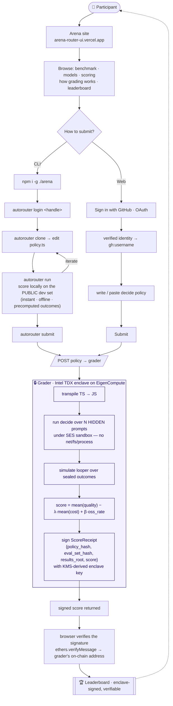

# AutoRouter Arena — user flow

How a participant goes from landing on the site to a verifiable, enclave-signed score on the leaderboard — and what happens under the hood at each step.

## What's happening, in words

1. **Land & browse** — the participant opens the Arena site and reads the benchmark (models, prices, scoring params `λ`/`β`, hidden-set hash) and the live leaderboard.
2. **Pick a path:**
   - **CLI** — install the `autorouter` CLI, `login`, `clone` a workspace, edit `policy.ts` (the `decide()` function), and `run` it locally against a **public dev set** (precomputed per-model outcomes → instant, offline). Iterate until the score looks good, then `submit`.
   - **Web** — **Sign in with GitHub** (OAuth) so the submission is tied to a *verified* identity (`gh:username`), then write/paste the policy and hit **Submit**.
3. **Grade in the enclave** — the grader (Intel TDX on EigenCompute) transpiles the policy, runs `decide()` under **SES capability isolation** (no `fetch`/`fs`/`process`, killed on timeout) over the **sealed hidden set** the participant never sees, simulates the chosen looper, computes `score = mean(quality) − λ·mean(cost) + β·oss_rate`, and **signs** a ScoreReceipt with a key that only exists inside the measured image.
4. **Verify & rank** — the signed score comes back; the browser recovers the signer with `ethers.verifyMessage` and checks it against the grader's on-chain Derived Address. The result lands on the leaderboard — and anyone can re-verify it, so no number can be faked.

## Trust boundary at a glance

- **You control:** only the `decide()` policy.
- **You never see:** the hidden prompts (sealed; decrypt only in the enclave).
- **You can't fake:** the score (signed by the enclave key) or, on the web path, your identity (GitHub-verified).
